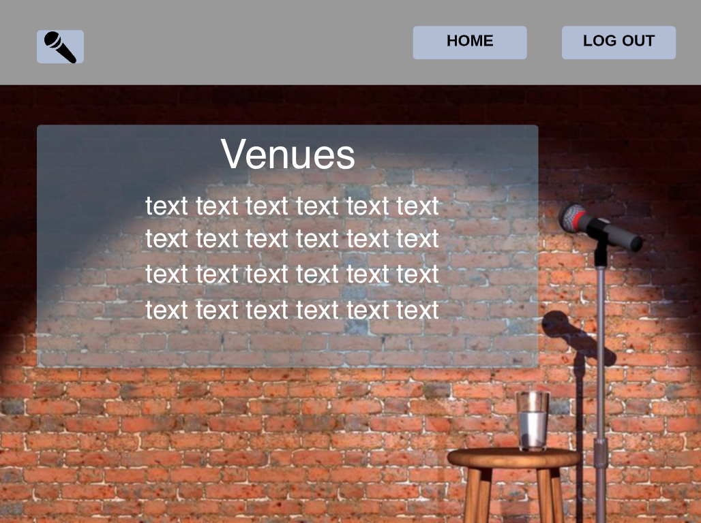

# Laughing Stock

## Curated lists of venues and comedians

 

Laughing Stock is a simple site geared towards providing users with valuable information regarding the ex

As a user, I want an app and site to deliver an ever growing list of venues and stand-up performers.

End user goal: As a user, I want to view various descriptions in order to make an educated decision on if a certain venue, performer, or combination of both are worth their time.
 
End business goal: Venues and performers may want to advertise on site in order to increase awareness of thier respective future events.
 
Measurement of success: Engagement and individual contribution will translate into the growth of the data for all data entities.

 

## Wireframes

### Welcome Screen

 
 

### Home Screen

 
 

### Venues Screen

 
 

### Comics Screen

## Technologies Used

